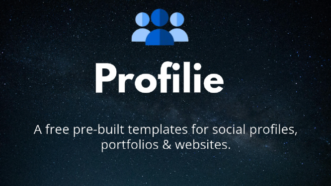

# Welcome to Profilie Documentation


A free pre-built templates for social profiles, portfolios & websites. Quickly create a sweet-looking website to highlight your social media presence.


## Introduction
Profilie is a service that provides free styles and scripts in the form of a CDN link that you can link into your project or website to use Profile's magical social profiles, portfolios, and website builder. 

## Configuration
THe Profilie is easy to use and configure. Simple CSS & JS code templates to create professional social profiles. No complex frameworks, just clean code that works.

## Support
If you have any questions or need assistance, feel free to open an issue ask for help in our [**GitHub repository**](https://github.com/profilie/profilie).

## Base URL
The base URL for all of our CDN links is:
```
https://cdn.harys.is-a.dev/profilie
```
